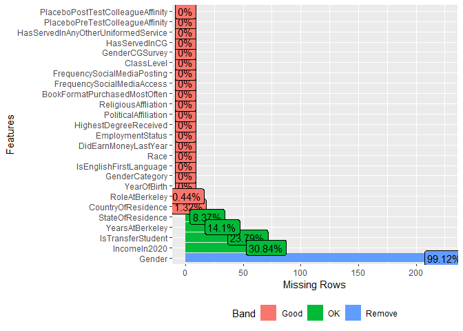

Experiments and Causality: W241 Final Project Coast Guards
================
Hanyu, Brendan and Abhi
4/2021

## Feature Engineering

### Load Data

``` r
d <- fread("data.csv",  na.strings=c("","NA"))

# head(d)
```

### Basic Distribution Checks

``` r
# display number of columns
length(d[0])
```

    ## [1] 124

``` r
# ResponseID is our primary key for the table as it is unique for each row and is guaranteed to be present
nrow(d[, .(count=.N), by = list(ResponseID)]) == nrow(d)
```

    ## [1] TRUE

``` r
d[, .(count=.N), by = list(ResponseType)]
```

    ##      ResponseType count
    ## 1: Survey Preview     8
    ## 2:     IP Address   304
    ## 3:           Spam     2

``` r
d[, .(count=.N), by = list(Finished)]
```

    ##    Finished count
    ## 1:     TRUE   284
    ## 2:    FALSE    30

``` r
d[, .(count=.N), by = list(Progress)]
```

    ##     Progress count
    ##  1:      100   285
    ##  2:       26     1
    ##  3:        1     5
    ##  4:       16     1
    ##  5:       13     1
    ##  6:        0     4
    ##  7:       40     2
    ##  8:       12     1
    ##  9:       89     1
    ## 10:       53     1
    ## 11:       14     1
    ## 12:       67     1
    ## 13:       63     1
    ## 14:       27     1
    ## 15:       99     1
    ## 16:       10     1
    ## 17:       15     2
    ## 18:       21     1
    ## 19:       49     1
    ## 20:       78     1
    ## 21:       69     1
    ##     Progress count

### Utility Tools

``` r
# gets a row by the field "Name" in dataframe "data"
getRowByName <- function(name, data) {
  return (data[data$Name == name, ]) 
}

# gets a row by the field "TreatmentCol" in dataframe "data"
getRowByTreatmentCol <- function(num, data) {
  return (data[data$TreatmentCol == paste("TreatmentQ", num, sep=""), ]) 
}

# gets a row by the field "ControlCol" in dataframe "data"
getRowByControlCol <- function(num, data) {
  return (data[data$ControlCol == paste("ControlQ", num, sep=""), ]) 
}

# gets a row by the field "ResponseID" in dataframe "data"
getRowByResponseID <- function(responseId, data) {
  return (data[data$ResponseID == responseId, ]) 
}

# are all treatment questions NA (condition for participant being in control group)
areAllTreatmentQNA <- function(data, rowNum) {
  return (is.na(data[rowNum]$TreatmentQ1) & is.na(d[rowNum]$TreatmentQ2) & is.na(d[rowNum]$TreatmentQ3) &   is.na(d[rowNum]$TreatmentQ4) & is.na(d[rowNum]$TreatmentQ5) & is.na(d[rowNum]$TreatmentQ6))
}

# are all control questions NA (condition for participant being in treatment group)
areAllControlQNA <- function(data, rowNum) {
  return (is.na(data[rowNum]$ControlQ1) & is.na(d[rowNum]$ControlQ2) & is.na(d[rowNum]$ControlQ3) &   is.na(d[rowNum]$ControlQ4) & is.na(d[rowNum]$ControlQ5) & is.na(d[rowNum]$ControlQ6))
}

# gets number of treatment columns that are NA 
getSumTreatmentQNA <- function(data, rowNum) {
  
  someTreatmentNA = c(is.na(data[rowNum]$TreatmentQ1), is.na(d[rowNum]$TreatmentQ2),  is.na(d[rowNum]$TreatmentQ3), is.na(d[rowNum]$TreatmentQ4), is.na(d[rowNum]$TreatmentQ5), is.na(d[rowNum]$TreatmentQ6))
  
  return (sum(someTreatmentNA))
}

# gets number of control columns that are NA 
getSumControlQNA <- function(data, rowNum) {
  
  someControlNA = c(is.na(data[rowNum]$ControlQ1), is.na(d[rowNum]$ControlQ2), is.na(d[rowNum]$ControlQ3),   is.na(d[rowNum]$ControlQ4), is.na(d[rowNum]$ControlQ5), is.na(d[rowNum]$ControlQ6))
  
  return (sum(someControlNA))
}

# if all 12 columns of treatment and control are NA, then the row is invalid
# represents a likely non-complier (never taker)
isInvalidRow <- function(data, rowNum) {
  return(getSumControlQNA(data, rowNum) + getSumTreatmentQNA(data, rowNum) == 12)
}

# if person was assigned to either treatment or control, but didn't end up answering all questions
# if person didn't answer any of the questions, then also they are considered an attritor
isAttritedRow <- function(data, rowNum) {
  cols = getSumControlQNA(data, rowNum) 
  result = (cols < 6 & cols > 0)
  if (result) {
    return (result)
  }
  
  cols = getSumTreatmentQNA(data, rowNum)
  result = (cols < 6 & cols > 0)
  return (result | isInvalidRow(data, rowNum))
}

# we cannot have some NA in both treatment and control
isInvalidTreatmentAssignment <- function(data, rowNum) {
  controlNa = getSumControlQNA(data, rowNum) 
  treatmentNa = getSumTreatmentQNA(data, rowNum)
  return ((controlNa > 0 & controlNa < 6) & (treatmentNa > 0 & treatmentNa < 6))
}

# generating random numbers from low to high for fake treatment/control responses
generateRandomIntNums <- function(n, mean, sd, low=1, high=7) {
  
  nums = mean + sd * scale(rnorm(n))
  # numbers must be low-high
  for (i in 1:nrow(nums)) {
    
    # arbitrarily choose floor or ceiling for that number (since response must be integer)
    if(sample(c(0,1), size =1))  {
      nums[i] = ceiling(nums[i])
    }
    else {
      nums[i] = floor(nums[i]) 
    }
    
    # bound number between low-high
    if(nums[i] < low) {
      nums[i] = low
    }
    
    if(nums[i] > high) {
      nums[i] = high
    }
  }
  
  return(nums[1:n])
}

medianWithoutNA<-function(x) {
   median(x[which(!is.na(x))])
}
```

``` r
nameResumeBinding <- data.table(
  Name  = c("Bradley Meyer", "Reginald Washington", "Kirsten Schmidt", "Gwendolyn Jackson"),
  Race = c("White", "Black", "White", "Black"),
  Gender = c("Male", "Male", "Female", "Female"),
  RaceGender = c("WM", "BM", "WF", "BF"),
  ResumeId   = c(1, 2, 3, 4)
)
```

``` r
treatmentBinding <- data.table(
  LeftPersonName  = c("Bradley Meyer", "Bradley Meyer", "Bradley Meyer", "Kirsten Schmidt", "Reginald Washington", "Kirsten Schmidt"),
  RightPersonName = c("Reginald Washington", "Kirsten Schmidt", "Gwendolyn Jackson", "Reginald Washington", "Gwendolyn Jackson", "Gwendolyn Jackson"),
  TreatmentCol = c("TreatmentQ1", "TreatmentQ2", "TreatmentQ3", "TreatmentQ4", "TreatmentQ5", "TreatmentQ6")
)
```

``` r
treatmentMetadata <- data.table(treatmentBinding)
n <- nrow(treatmentMetadata)

# fill dummy values to create column names
for (i in 1:n) {
  treatmentMetadata$LeftPersonRace = "test"
  treatmentMetadata$LeftPersonGender = "test"
  treatmentMetadata$LeftPersonRaceGender = "test"
  treatmentMetadata$LeftPersonResumeId = "test"
   
  treatmentMetadata$RightPersonRace = "test"
  treatmentMetadata$RightPersonGender = "test"
  treatmentMetadata$RightPersonRaceGender = "test"
  treatmentMetadata$RightPersonResumeId = "test"
}

# iterate through left name and fill left person metadata
for (i in 1:n) {
  row <- getRowByName(treatmentMetadata[i]$LeftPersonName, nameResumeBinding)
   
  treatmentMetadata[i]$LeftPersonRace = row$Race
  treatmentMetadata[i]$LeftPersonGender = row$Gender
  treatmentMetadata[i]$LeftPersonRaceGender = row$RaceGender
  treatmentMetadata[i]$LeftPersonResumeId = row$ResumeId
}

# iterate through right name and fill right person metadata
for (i in 1:n) {
  row <- getRowByName(treatmentMetadata[i]$RightPersonName, nameResumeBinding)
   
  treatmentMetadata[i]$RightPersonRace = row$Race
  treatmentMetadata[i]$RightPersonGender = row$Gender
  treatmentMetadata[i]$RightPersonRaceGender = row$RaceGender
  treatmentMetadata[i]$RightPersonResumeId = row$ResumeId
}
```

``` r
controlBinding <- data.table(
  LeftPersonResumeId  = c(1, 1, 1, 3, 2, 3),
  RightPersonResumeId = c(2, 3, 4, 2, 4, 4),
  ControlCol = c("ControlQ1", "ControlQ2", "ControlQ3", "ControlQ4", "ControlQ5", "ControlQ6")
)
```

### Identifying Attrition and Non Compliance + Treatment Assignment

``` r
# treatment and control assignment
n <- nrow(d)

# have valid columns for treatment assignment and attrition
d$TreatmentAssignment = NA
d$IsAttrited = NA
d$IsNeverTaker = NA

for (i in 1:n) {
  # row <- getRowByResponseID(d[i]$ResponseID, d)
  
  control <- areAllTreatmentQNA(d, i)
  treatment <- areAllControlQNA(d, i)
  isInvalid <- isInvalidRow(d, i)
  isAttrited <- isAttritedRow(d, i)
  isInvalidTreatmentAssigned <- isInvalidTreatmentAssignment(d, i)
  
  # print(c(control, treatment, isInvalid, isAttrited, isInvalidTreatmentAssigned))
  if (isInvalid | isInvalidTreatmentAssigned) {
    
    if (isInvalidTreatmentAssigned) {
      e = sprintf("Row %s has invalid treatment assignment", i)  
      stop(e)
    }
    
    if (isInvalid) {
      sprintf("Row %s has no responses in treatment and control columns", i)  
    }
    
    d[i]$TreatmentAssignment = NA
    
  }
  else {
    
    if (treatment & control) {
      e = sprintf("Both treatment and control are true! This should never happen! Error found in row %s", i)
      stop(e)
    }
    
    d[i]$TreatmentAssignment = treatment  
  }
  
  d[i]$IsAttrited = isAttrited
  d[i]$IsNeverTaker = isInvalid
  
  # special case, if we find attrition only, then we need to re-assign treatment  
  if (isAttrited & !(isInvalid | isInvalidTreatmentAssigned)) {
    
    numNa = getSumTreatmentQNA(d, i)
    treatment = numNa > 0 & numNa < 6    
    d[i]$TreatmentAssignment = treatment      
  
  }
}
```

``` r
d[, .(count=.N), by = list(TreatmentAssignment)]
```

    ##    TreatmentAssignment count
    ## 1:                  NA    32
    ## 2:               FALSE   143
    ## 3:                TRUE   139

``` r
d[, .(count=.N), by = list(IsAttrited)]
```

    ##    IsAttrited count
    ## 1:       TRUE    33
    ## 2:      FALSE   281

``` r
# do a sanity check of who we think are "attritors" vs what qualtrics thinks are "attritors"
responseIDsAttrited = d[IsAttrited == TRUE, ResponseID]
responseIDsBad = d[Finished == FALSE | ResponseType != "IP Address", ResponseID]
responseIDsUnFinishedOnly = d[Finished == FALSE, ResponseID]

# there seem to be a mismatch in what we consider attrited vs what Qualtrics thinks is attrited
length(responseIDsAttrited)
```

    ## [1] 33

``` r
length(responseIDsBad)
```

    ## [1] 40

``` r
length(responseIDsUnFinishedOnly)
```

    ## [1] 30

``` r
# Number of common elements between these sets
length(intersect(responseIDsAttrited, responseIDsBad))
```

    ## [1] 29

``` r
length(intersect(responseIDsAttrited, responseIDsUnFinishedOnly))
```

    ## [1] 26

``` r
# setdiff tells us the response IDs that exist in the first list, but dont exist in the 2nd list

print("These are the respondents we think are attritors but Qualtrics thinks are not attritors")
```

    ## [1] "These are the respondents we think are attritors but Qualtrics thinks are not attritors"

``` r
setdiff(responseIDsAttrited, responseIDsBad)
```

    ## [1] "R_1mquxpzqO154HvP" "R_sbzFZuUqtaBaCR3" "R_3PhFt6wfKWlz3LM"
    ## [4] "R_22SmK7qgpdwWIDV"

``` r
print("These are the respondents Qualtrics think are attritors but we think are not")
```

    ## [1] "These are the respondents Qualtrics think are attritors but we think are not"

``` r
setdiff(responseIDsBad, responseIDsAttrited)
```

    ##  [1] "R_2rORoun447CrzQB" "R_2QSquguoMN5Dj7A" "R_2Yn2e6TZ2jGGDgh"
    ##  [4] "R_V3IqeSnvscmn2Mx" "R_scHLCigTnnJHMVb" "R_31vJynnHBul11qv"
    ##  [7] "R_3fOa4QVxUnOCVUD" "R_zTKeFpVhVNAZPjj" "R_1E6Y207cj3ZVUY0"
    ## [10] "R_2BlcjDxd8DaWZio" "R_3rJpZq7KiJ8aUqE"

``` r
setdiff(responseIDsAttrited, responseIDsUnFinishedOnly)
```

    ## [1] "R_3kpkeubEVJMXVeY" "R_1mquxpzqO154HvP" "R_sbzFZuUqtaBaCR3"
    ## [4] "R_3Db9GpUuKV9bATZ" "R_2zo1aIOrEzj31Mt" "R_3PhFt6wfKWlz3LM"
    ## [7] "R_22SmK7qgpdwWIDV"

``` r
setdiff(responseIDsUnFinishedOnly, responseIDsAttrited)
```

    ## [1] "R_zTKeFpVhVNAZPjj" "R_1E6Y207cj3ZVUY0" "R_2BlcjDxd8DaWZio"
    ## [4] "R_3rJpZq7KiJ8aUqE"

``` r
# Examining the list that qualtrics thinks are attritors, we see in fact they are not attritors, so we'll stick to our definition
# example: d[ResponseID == "R_1E6Y207cj3ZVUY0"]
```

### Filter Abnormal Rows

``` r
# filter out rows where we feel the respondent just clicked through the answers
# if their average answering time is abnormally low, then they were likely not interested in the survey
# and thus, we can exclude them

# We check the average time people take to evaluate 6 pairs of resumes.
# FC: first click; LC: last click; PS: page submit; CC: click count
# Note that according to Qualtrics, page submit time is the time spent (sec) on the page before we submit the question
# https://www.qualtrics.com/support/survey-platform/survey-module/editing-questions/question-types-guide/advanced/timing/#TimingOptions
# Thus, we don't have to worry about subtracting "first click" time from "page submit" time to get duration spent on the page

d <- d[, AvgTime := as.double(-1)]

n <- nrow(d)

for (i in 1:n) {
  
  if (!is.na(d[i]$TreatmentAssignment) & d[i]$TreatmentAssignment == TRUE) {
    
    diff1 = d[i]$TimePS_TreatmentQ1 - d[i]$TimeFC_TreatmentQ1
    diff2 = d[i]$TimePS_TreatmentQ2 - d[i]$TimeFC_TreatmentQ2
    diff3 = d[i]$TimePS_TreatmentQ3 - d[i]$TimeFC_TreatmentQ3
    diff4 = d[i]$TimePS_TreatmentQ4 - d[i]$TimeFC_TreatmentQ4
    diff5 = d[i]$TimePS_TreatmentQ5 - d[i]$TimeFC_TreatmentQ5
    diff6 = d[i]$TimePS_TreatmentQ6 - d[i]$TimeFC_TreatmentQ6
    
    if (!is.na(diff1) & !is.na(diff2) & !is.na(diff3) & !is.na(diff4) & !is.na(diff5) & !is.na(diff6)) {
      # diffs must always be positive, as page submit comes after first click
      if (diff1 < 0 | diff2 < 0 | diff3 < 0 | diff4 < 0 | diff5 < 0 | diff6 < 0) {
        e = sprintf("At least one diff is less than 0! Error found in row %s", i)
        stop(e)
      }      
    }

    
    d[i]$AvgTime = (d[i]$TimePS_TreatmentQ1 + d[i]$TimePS_TreatmentQ2 + d[i]$TimePS_TreatmentQ3 + d[i]$TimePS_TreatmentQ4 + d[i]$TimePS_TreatmentQ5 + d[i]$TimePS_TreatmentQ6) / nrow(treatmentMetadata)
  
    }
  
  
  else {
    
    diff1 = d[i]$TimePS_ControlQ1 - d[i]$TimeFC_ControlQ1
    diff2 = d[i]$TimePS_ControlQ2 - d[i]$TimeFC_ControlQ2
    diff3 = d[i]$TimePS_ControlQ3 - d[i]$TimeFC_ControlQ3
    diff4 = d[i]$TimePS_ControlQ4 - d[i]$TimeFC_ControlQ4
    diff5 = d[i]$TimePS_ControlQ5 - d[i]$TimeFC_ControlQ5
    diff6 = d[i]$TimePS_ControlQ6 - d[i]$TimeFC_ControlQ6
    
    if (!is.na(diff1) & !is.na(diff2) & !is.na(diff3) & !is.na(diff4) & !is.na(diff5) & !is.na(diff6)) {
      # diffs must always be positive, as page submit comes after first click
      if (diff1 < 0 | diff2 < 0 | diff3 < 0 | diff4 < 0 | diff5 < 0 | diff6 < 0) {
        e = sprintf("At least one diff is less than 0! Error found in row %s", i)
        stop(e)
      }      
    }
    
    d[i]$AvgTime = (d[i]$TimePS_ControlQ1 + d[i]$TimePS_ControlQ2 + d[i]$TimePS_ControlQ3 + d[i]$TimePS_ControlQ4 + d[i]$TimePS_ControlQ5 + d[i]$TimePS_ControlQ6) / nrow(treatmentMetadata)
  
    }
}

hist(d[TreatmentAssignment == FALSE]$AvgTime, 
     breaks = 100, 
     main = 'Histogram for averge answering time for control group questions', 
     xlab='Averge answering time')
```

<!-- -->

``` r
hist(d[TreatmentAssignment == TRUE]$AvgTime, 
     breaks = 100, 
     main = 'Histogram for averge answering time for treatment group questions', 
     xlab='Averge answering time')
```

<!-- -->

``` r
print('Median of averge answering time for control group questions')
```

    ## [1] "Median of averge answering time for control group questions"

``` r
medianWithoutNA(d[TreatmentAssignment == FALSE]$AvgTime)
```

    ## [1] 25.75842

``` r
print('Median of averge answering time for treatment group questions')
```

    ## [1] "Median of averge answering time for treatment group questions"

``` r
medianWithoutNA(d[TreatmentAssignment == TRUE]$AvgTime)
```

    ## [1] 27.11683

``` r
# If answering time is relatively short (< 10 sec), we remove the record
nrow(d)
```

    ## [1] 314

``` r
d <- d[AvgTime >= 10]
nrow(d)
```

    ## [1] 234

``` r
# There are outliers such as 25 and 2020, as well as abnormal values such as country names. So we remove those rows
d <- d[, YearOfBirth:=as.integer(YearOfBirth)]
```

    ## Warning in eval(jsub, SDenv, parent.frame()): NAs introduced by coercion

``` r
nrow(d)
```

    ## [1] 234

``` r
d <- d[YearOfBirth < 2015 & YearOfBirth > 1950]
nrow(d)
```

    ## [1] 227

## Create Datasets Per Question

``` r
cols <- colnames(d)
coreColumns <- cols[!startsWith(cols, "TimeFC_") & !startsWith(cols, "TimeLC_") & !startsWith(cols, "TimePS_") & !startsWith(cols, "TimeCC_") & !startsWith(cols, "TreatmentQ") & !startsWith(cols, "ControlQ")]

getCoreColumnsDataset <- function() {
  return(d %>% select(one_of(coreColumns)))
}

getTreatmentDataset <- function(qNum) {
  treatmentqNum = paste("TreatmentQ", qNum, sep ="")
  treatmentSet = (d %>% select(one_of(coreColumns) | ends_with(treatmentqNum)))
  return (treatmentSet[TreatmentAssignment == TRUE, ])
}

getControlDataset <- function(qNum) {
  controlqNum = paste("ControlQ", qNum, sep ="")
  controlSet = (d %>% select(one_of(coreColumns) | ends_with(controlqNum)))
  return (controlSet[TreatmentAssignment == FALSE, ])
}
```

``` r
dCore = getCoreColumnsDataset()

dTQ1 = getTreatmentDataset(1)
dTQ2 = getTreatmentDataset(2)
dTQ3 = getTreatmentDataset(3)
dTQ4 = getTreatmentDataset(4)
dTQ5 = getTreatmentDataset(5)
dTQ6 = getTreatmentDataset(6)

# sanity check to see all data sets are of the same size
nrow(dTQ1) == nrow(dTQ2)
```

    ## [1] TRUE

``` r
nrow(dTQ2) == nrow(dTQ3) 
```

    ## [1] TRUE

``` r
nrow(dTQ3) == nrow(dTQ4) 
```

    ## [1] TRUE

``` r
nrow(dTQ4) == nrow(dTQ5) 
```

    ## [1] TRUE

``` r
nrow(dTQ5) == nrow(dTQ6)
```

    ## [1] TRUE

``` r
dCQ1 = getControlDataset(1)
dCQ2 = getControlDataset(2)
dCQ3 = getControlDataset(3)
dCQ4 = getControlDataset(4)
dCQ5 = getControlDataset(5)
dCQ6 = getControlDataset(6)

# sanity check to see all data sets are of the same size
nrow(dCQ1) == nrow(dCQ2)
```

    ## [1] TRUE

``` r
nrow(dCQ2) == nrow(dCQ3) 
```

    ## [1] TRUE

``` r
nrow(dCQ3) == nrow(dCQ4) 
```

    ## [1] TRUE

``` r
nrow(dCQ4) == nrow(dCQ5) 
```

    ## [1] TRUE

``` r
nrow(dCQ5) == nrow(dCQ6)
```

    ## [1] TRUE

``` r
# head(dTQ1)
```

### Assign Fake Treatment and Control Reponses (Optional)

> As we are aware, we had an error in the procedure around collecting
> data for our participants. Thus we will overwrite the data with fake
> responses so as to prove out our analysis methodology. Below we choose
> a `random number generator to generate responses from 1-7`. The rubric
> is as follows:

> `1: Strongly prefer left resume`

> `2: Prefer left resume`

> `3: Slightly prefer left resume`

> `4: Neutral (no preference on left or right resume)`

> `5: Slightly prefer right resume`

> `6: Prefer right resume`

> `7: Strongly prefer right resume`

``` r
# We deliberately give fake treatment effects
dTQ1$TreatmentQ1 = generateRandomIntNums(nrow(dTQ1), 1, 1) # WM BM
dTQ2$TreatmentQ2 = generateRandomIntNums(nrow(dTQ2), 2, 1) # WM WF
dTQ3$TreatmentQ3 = generateRandomIntNums(nrow(dTQ3), 5, 1) # WM BF
dTQ4$TreatmentQ4 = generateRandomIntNums(nrow(dTQ4), 4, 1) # WF BM
dTQ5$TreatmentQ5 = generateRandomIntNums(nrow(dTQ5), 4, 1) # BM BF
dTQ6$TreatmentQ6 = generateRandomIntNums(nrow(dTQ6), 2, 1) # WF BF

# Note: means are typically underestimated
print("Treatment Means")
```

    ## [1] "Treatment Means"

``` r
mean(dTQ1$TreatmentQ1)
```

    ## [1] 1.469565

``` r
mean(dTQ2$TreatmentQ2)
```

    ## [1] 2.06087

``` r
mean(dTQ3$TreatmentQ3)
```

    ## [1] 4.965217

``` r
mean(dTQ4$TreatmentQ4)
```

    ## [1] 4.008696

``` r
mean(dTQ5$TreatmentQ5)
```

    ## [1] 3.930435

``` r
mean(dTQ6$TreatmentQ6)
```

    ## [1] 2.06087

``` r
# We expect the control group to have no difference in left / right resumes (on average)
dCQ1$ControlQ1 = generateRandomIntNums(nrow(dCQ1), 3.5, 1)
dCQ2$ControlQ2 = generateRandomIntNums(nrow(dCQ2), 5, 2)
dCQ3$ControlQ3 = generateRandomIntNums(nrow(dCQ3), 6.5, 2)
dCQ4$ControlQ4 = generateRandomIntNums(nrow(dCQ4), 4, 1)
dCQ5$ControlQ5 = generateRandomIntNums(nrow(dCQ5), 4, 1)
dCQ6$ControlQ6 = generateRandomIntNums(nrow(dCQ6), 5, 1)

# Note: means are typically underestimated
print("Control Means")
```

    ## [1] "Control Means"

``` r
mean(dCQ1$ControlQ1)
```

    ## [1] 3.526786

``` r
mean(dCQ2$ControlQ2)
```

    ## [1] 4.732143

``` r
mean(dCQ3$ControlQ3)
```

    ## [1] 5.848214

``` r
mean(dCQ4$ControlQ4)
```

    ## [1] 4.089286

``` r
mean(dCQ5$ControlQ5)
```

    ## [1] 3.892857

``` r
mean(dCQ6$ControlQ6)
```

    ## [1] 5.035714

### Get Final Dataset

``` r
addTreatmentMetadataToDataset <- function(dt, treatmentNum) {
  
  row = getRowByTreatmentCol(treatmentNum, treatmentMetadata)
  
  dt$LeftPersonName = row$LeftPersonName
  dt$LeftPersonRace = row$LeftPersonRace
  dt$LeftPersonGender = row$LeftPersonGender
  dt$LeftPersonRaceGender = row$LeftPersonRaceGender
  dt$LeftPersonResumeId = row$LeftPersonResumeId
    
  dt$RightPersonName = row$RightPersonName
  dt$RightPersonRace = row$RightPersonRace
  dt$RightPersonGender = row$RightPersonGender
  dt$RightPersonRaceGender = row$RightPersonRaceGender
  dt$RightPersonResumeId = row$RightPersonResumeId
  
  return(dt)
}

addControlMetadataToDataset <- function(dt, controlNum) {
  
  row = getRowByControlCol(controlNum, controlBinding)

  # only resume ID is available in the control group (by design)
  dt$LeftPersonName = NA
  dt$LeftPersonRace = NA
  dt$LeftPersonGender = NA
  dt$LeftPersonRaceGender = NA
  dt$LeftPersonResumeId = row$LeftPersonResumeId
  
  # only resume ID is available in the control group (by design)
  dt$RightPersonName = NA
  dt$RightPersonRace = NA
  dt$RightPersonGender = NA
  dt$RightPersonRaceGender = NA
  dt$RightPersonResumeId = row$RightPersonResumeId
  
  return(dt)
}

dTQ1 = addTreatmentMetadataToDataset(dTQ1, 1)
dTQ2 = addTreatmentMetadataToDataset(dTQ2, 2)
dTQ3 = addTreatmentMetadataToDataset(dTQ3, 3)
dTQ4 = addTreatmentMetadataToDataset(dTQ4, 4)
dTQ5 = addTreatmentMetadataToDataset(dTQ5, 5)
dTQ6 = addTreatmentMetadataToDataset(dTQ6, 6)

dCQ1 = addControlMetadataToDataset(dCQ1, 1)
dCQ2 = addControlMetadataToDataset(dCQ2, 2)
dCQ3 = addControlMetadataToDataset(dCQ3, 3)
dCQ4 = addControlMetadataToDataset(dCQ4, 4)
dCQ5 = addControlMetadataToDataset(dCQ5, 5)
dCQ6 = addControlMetadataToDataset(dCQ6, 6)
```

``` r
# First, we notice that the 2 datasets dont have the same columns
print("Before convergence")
```

    ## [1] "Before convergence"

``` r
identical(colnames(dTQ1), colnames(dCQ1))
```

    ## [1] FALSE

``` r
# Since the "Question columns" are named like "TimeFC_TreatmentQ1" in the treatment set and "TimeFC_ControlQ1" in the control set
# Thus we snap to naming these as "TimeFCQ" in both treatment and control. We add a dedicated column for Question Number as well to differentiate.
# The same naming convention goes for other columns - TimePS, TimeLS, TimeCC etc.

convergeTreatmentColumns <- function(dt, qNum) {
  names(dt)[names(dt) == paste("TimeFC_TreatmentQ", qNum, sep = "")] <- paste("TimeFCQ")
  names(dt)[names(dt) == paste("TimeLC_TreatmentQ", qNum, sep = "")] <- paste("TimeLCQ")
  names(dt)[names(dt) == paste("TimePS_TreatmentQ", qNum, sep = "")] <- paste("TimePSQ")
  names(dt)[names(dt) == paste("TimeCC_TreatmentQ", qNum, sep = "")] <- paste("TimeCCQ")
  names(dt)[names(dt) == paste("TreatmentQ", qNum, sep = "")] <- paste("ResponseQ")
  dt$QNum = qNum
  return(dt)
}

convergeControlColumns <- function(dt, qNum) {
  names(dt)[names(dt) == paste("TimeFC_ControlQ", qNum, sep = "")] <- paste("TimeFCQ")
  names(dt)[names(dt) == paste("TimeLC_ControlQ", qNum, sep = "")] <- paste("TimeLCQ")
  names(dt)[names(dt) == paste("TimePS_ControlQ", qNum, sep = "")] <- paste("TimePSQ")
  names(dt)[names(dt) == paste("TimeCC_ControlQ", qNum, sep = "")] <- paste("TimeCCQ")
  names(dt)[names(dt) == paste("ControlQ", qNum, sep = "")] <- paste("ResponseQ")
  dt$QNum = qNum
  return(dt)
}

dTQ1 = convergeTreatmentColumns(dTQ1, 1)
dCQ1 = convergeControlColumns(dCQ1, 1)

# now the test should pass 
print("After convergence")
```

    ## [1] "After convergence"

``` r
identical(colnames(dTQ1), colnames(dCQ1))
```

    ## [1] TRUE

``` r
# do the same for other questions

dTQ2 = convergeTreatmentColumns(dTQ2, 2)
dCQ2 = convergeControlColumns(dCQ2, 2)

dTQ3 = convergeTreatmentColumns(dTQ3, 3)
dCQ3 = convergeControlColumns(dCQ3, 3)

dTQ4 = convergeTreatmentColumns(dTQ4, 4)
dCQ4 = convergeControlColumns(dCQ4, 4)

dTQ5 = convergeTreatmentColumns(dTQ5, 5)
dCQ5 = convergeControlColumns(dCQ5, 5)

dTQ6 = convergeTreatmentColumns(dTQ6, 6)
dCQ6 = convergeControlColumns(dCQ6, 6)

# sanity check on column names for all datasets
identical(colnames(dTQ2), colnames(dCQ2))
```

    ## [1] TRUE

``` r
identical(colnames(dTQ3), colnames(dCQ3))
```

    ## [1] TRUE

``` r
identical(colnames(dTQ4), colnames(dCQ4))
```

    ## [1] TRUE

``` r
identical(colnames(dTQ5), colnames(dCQ5))
```

    ## [1] TRUE

``` r
identical(colnames(dTQ6), colnames(dCQ6))
```

    ## [1] TRUE

``` r
# now that we have converged on column names, we should be able to merge all data sets in row major format
appendAllDataTables <- function(tableList) {
  obj <- deparse(substitute(tableList[1]))
  assign(obj, value = data.table::rbindlist(tableList), envir = .GlobalEnv)
}
  
dataset = appendAllDataTables(list(dTQ1, dTQ2, dTQ3, dTQ4, dTQ5, dTQ6, dCQ1, dCQ2, dCQ3, dCQ4, dCQ5, dCQ6))
```

    ## Warning in assign(obj, value = data.table::rbindlist(tableList), envir
    ## = .GlobalEnv): only the first element is used as variable name

``` r
# AgeBin is a feature of interest for us, which tells us which age group the respondent belongs to
# We will infer this from the YearOfBirth variable

# First convert the variable to numeric
dataset$YearOfBirth = as.numeric(dataset$YearOfBirth)
# Get current age
dataset$Age = as.integer(format(Sys.Date(), "%Y")) - dataset$YearOfBirth
# Add a column called AgeBin
dataset$AgeBin = "NA"

# TODO: clean up - probably a better way to implement this
assignAgeBin <- function(dt) {
  
  for (i in 1:nrow(dt)) {
    
          # we were able to parse the year as an int
          if (!is.na(dt[i]$Age) & is.numeric(dt[i]$Age) & dt[i]$Age > 0 & (floor(log10(dt[i]$YearOfBirth)) + 1) == 4) {
              # valid age, assign to category
              # we will keep things simple and have 0-12, 12-25, 25-40, 40-60, 60+
              # for age under 6, we assume that the age is invalid and need to be removed later
              if (dt[i]$Age <= 6) {
                dt[i]$AgeBin = NA
              } else if (dt[i]$Age <= 12) {
                dt[i]$AgeBin = "Child"
              } else if (dt[i]$Age <= 25) {
                dt[i]$AgeBin = "Student"
              } else if (dt[i]$Age <= 40) {
                dt[i]$AgeBin = "Adult"
              } else if (dt[i]$Age <= 60) {
                dt[i]$AgeBin = "MiddleAge"
              } else if (dt[i]$Age > 60) {
                dt[i]$AgeBin = "Senior"
              } else {
                dt[i]$AgeBin = NA
              }
          
          }
          else {
            # assign to NA
            dt[i]$AgeBin = NA
          }
    
  } # end of for loop
  
  return(dt)
}


dataset = assignAgeBin(dataset)
```

## Feature Analysis

``` r
tryCatch(
  {
    nrow(d)
  },
  error = function(e) {
    print("d variable not found, cannot proceed further!")
    stop(e)
  }
)
```

    ## [1] 227

### Check Balance of Control & Treatment Assignments

``` r
# Ratio of Treatment and Assignment (After removal of outliers and abnormal data)
d[, .(count=.N), by = list(TreatmentAssignment)]
```

    ##    TreatmentAssignment count
    ## 1:               FALSE   112
    ## 2:                TRUE   115

### Check Covariates For Missing Data

``` r
# Proportion of missing values in covariates
plot_missing(d[, c('YearOfBirth', 'GenderCategory','Gender','IsEnglishFirstLanguage','Race','CountryOfResidence','StateOfResidence','RoleAtBerkeley','IsTransferStudent','YearsAtBerkeley','DidEarnMoneyLastYear','EmploymentStatus','IncomeIn2020','HighestDegreeReceived','PoliticalAffiliation','ReligiousAffliation','BookFormatPurchasedMostOften','FrequencySocialMediaAccess','FrequencySocialMediaPosting','ClassLevel','GenderCGSurvey','HasServedInCG','HasServedInAnyOtherUniformedService','PlaceboPreTestColleagueAffinity','PlaceboPostTestColleagueAffinity')])
```

<!-- -->

> We are going to ignore last 5 variables that have too many missing
> values.

``` r
# Covariate balance check (The only continuous variable: YearOfBirth)
# We have already removed outliers and abnormal values in feature engineering
plot_density(d$YearOfBirth)
```

<!-- -->

> Most of respondents are around 20 years old.

### Covariate Balance Check

``` r
# Covariate balance check (Overall)
plot_bar(d[, c('GenderCategory','IsEnglishFirstLanguage','HighestDegreeReceived','Race','RoleAtBerkeley','DidEarnMoneyLastYear','EmploymentStatus','PoliticalAffiliation','ReligiousAffliation','BookFormatPurchasedMostOften','FrequencySocialMediaAccess','FrequencySocialMediaPosting','ClassLevel','GenderCGSurvey','HasServedInCG','HasServedInAnyOtherUniformedService','CountryOfResidence')], nrow=2, ncol=1)
```

<!-- --><!-- --><!-- --><!-- --><!-- --><!-- --><!-- --><!-- --><!-- -->

> Most of the respondents have never served in uniformed service before,
> so it is hard to say that their reply will reflect the actual
> treatments that we hope to observe in the CG survey. Almost all
> respondents are from the United States. Around 66% of the respondents
> are female, half of them are Asian. Roughly half of the respondents
> are democrats, and only 5.3% of them are republicans. The main source
> of data is xlab (undergraduate Berkeley students). It has to be kept
> in mind that the treatment effects observed here would be vastly
> different than those observed in the actual survey.

``` r
# Covariate balance check (Control vs Treatment)
matchO <- matchit(TreatmentAssignment ~ YearOfBirth + GenderCategory + Race + IsEnglishFirstLanguage + HighestDegreeReceived + DidEarnMoneyLastYear +
                     EmploymentStatus + PoliticalAffiliation + ReligiousAffliation + BookFormatPurchasedMostOften + FrequencySocialMediaAccess +
                     FrequencySocialMediaPosting + ClassLevel + GenderCGSurvey + HasServedInCG + HasServedInAnyOtherUniformedService, 
                   data = d,
                   method = NULL)
```

    ## Warning: glm.fit: algorithm did not converge

``` r
summary(matchO)
```

    ## 
    ## Call:
    ## matchit(formula = TreatmentAssignment ~ YearOfBirth + GenderCategory + 
    ##     Race + IsEnglishFirstLanguage + HighestDegreeReceived + DidEarnMoneyLastYear + 
    ##     EmploymentStatus + PoliticalAffiliation + ReligiousAffliation + 
    ##     BookFormatPurchasedMostOften + FrequencySocialMediaAccess + 
    ##     FrequencySocialMediaPosting + ClassLevel + GenderCGSurvey + 
    ##     HasServedInCG + HasServedInAnyOtherUniformedService, data = d, 
    ##     method = NULL)
    ## 
    ## Summary of Balance for All Data:
    ##                                                            Means Treated
    ## distance                                                          0.6336
    ## YearOfBirth                                                    1998.3217
    ## GenderCategoryCisgender Man                                       0.3391
    ## GenderCategoryCisgender Woman                                     0.5913
    ## GenderCategoryNon-binary                                          0.0261
    ## GenderCategoryOther                                               0.0174
    ## GenderCategoryPrefer not to disclose                              0.0174
    ## GenderCategoryTransgender Man                                     0.0087
    ## RaceAsian                                                         0.5913
    ## RaceBlack or African American                                     0.0522
    ## RaceHispanic or Latino                                            0.0870
    ## RaceNative American                                               0.0000
    ## RaceNative Hawaiian or Pacific Islander                           0.0000
    ## RaceNon-Hispanic White                                            0.2000
    ## RaceOther:                                                        0.0609
    ## RacePrefer not to answer                                          0.0087
    ## IsEnglishFirstLanguageNo                                          0.2348
    ## IsEnglishFirstLanguagePrefer not to say                           0.0174
    ## IsEnglishFirstLanguageYes                                         0.7478
    ## HighestDegreeReceivedAdvanced degree (Master's, Doctorate)        0.0522
    ## HighestDegreeReceivedBachelor's degree                            0.2087
    ## HighestDegreeReceivedNo college                                   0.2000
    ## HighestDegreeReceivedSome college                                 0.5391
    ## DidEarnMoneyLastYearNo                                            0.3217
    ## DidEarnMoneyLastYearYes                                           0.6783
    ## EmploymentStatusEmployed full time                                0.0783
    ## EmploymentStatusEmployed part time                                0.2261
    ## EmploymentStatusStudent                                           0.6174
    ## EmploymentStatusUnemployed looking for work                       0.0696
    ## EmploymentStatusUnemployed not looking for work                   0.0087
    ## PoliticalAffiliationDemocrat                                      0.5217
    ## PoliticalAffiliationIndependent                                   0.2000
    ## PoliticalAffiliationOther                                         0.0696
    ## PoliticalAffiliationPrefer not to say                             0.0957
    ## PoliticalAffiliationRepublican                                    0.0609
    ## PoliticalAffiliationSocialist                                     0.0522
    ## ReligiousAffliationAtheist or agnostic                            0.4609
    ## ReligiousAffliationBuddhist                                       0.0348
    ## ReligiousAffliationHindu                                          0.0522
    ## ReligiousAffliationJewish                                         0.0435
    ## ReligiousAffliationMuslim                                         0.0174
    ## ReligiousAffliationOther Christian:                               0.0696
    ## ReligiousAffliationOther:                                         0.0087
    ## ReligiousAffliationPrefer not to say                              0.1130
    ## ReligiousAffliationProtestant                                     0.0696
    ## ReligiousAffliationRoman Catholic                                 0.1304
    ## BookFormatPurchasedMostOftenI buy both                            0.3130
    ## BookFormatPurchasedMostOftenI buy ebooks                          0.1217
    ## BookFormatPurchasedMostOftenI buy physical books                  0.3304
    ## BookFormatPurchasedMostOftenI don't purchase books                0.2348
    ## FrequencySocialMediaAccessDaily                                   0.2261
    ## FrequencySocialMediaAccessLess than Weekly                        0.0348
    ## FrequencySocialMediaAccessMore than once a day                    0.6870
    ## FrequencySocialMediaAccessWeekly                                  0.0522
    ## FrequencySocialMediaPostingDaily                                  0.0609
    ## FrequencySocialMediaPostingLess than Weekly                       0.7913
    ## FrequencySocialMediaPostingMore than once a day                   0.0522
    ## FrequencySocialMediaPostingWeekly                                 0.0957
    ## ClassLevelFresh/Soph                                              0.3217
    ## ClassLevelGrad/Post-Grad                                          0.1391
    ## ClassLevelJr/Sr                                                   0.4696
    ## ClassLevelPrefer not to answer                                    0.0696
    ## GenderCGSurveyFemale                                              0.5913
    ## GenderCGSurveyMale                                                0.3739
    ## GenderCGSurveyNon-binary / third gender                           0.0261
    ## GenderCGSurveyPrefer not to answer                                0.0087
    ## HasServedInCGNo                                                   0.9913
    ## HasServedInCGPrefer not to answer                                 0.0087
    ## HasServedInCGYes                                                  0.0000
    ## HasServedInAnyOtherUniformedServiceNo                             0.9739
    ## HasServedInAnyOtherUniformedServicePrefer not to answer           0.0087
    ## HasServedInAnyOtherUniformedServiceYes                            0.0174
    ##                                                            Means Control
    ## distance                                                          0.3983
    ## YearOfBirth                                                    1997.4554
    ## GenderCategoryCisgender Man                                       0.2857
    ## GenderCategoryCisgender Woman                                     0.6429
    ## GenderCategoryNon-binary                                          0.0536
    ## GenderCategoryOther                                               0.0089
    ## GenderCategoryPrefer not to disclose                              0.0000
    ## GenderCategoryTransgender Man                                     0.0089
    ## RaceAsian                                                         0.5000
    ## RaceBlack or African American                                     0.0179
    ## RaceHispanic or Latino                                            0.1071
    ## RaceNative American                                               0.0089
    ## RaceNative Hawaiian or Pacific Islander                           0.0089
    ## RaceNon-Hispanic White                                            0.3304
    ## RaceOther:                                                        0.0179
    ## RacePrefer not to answer                                          0.0089
    ## IsEnglishFirstLanguageNo                                          0.2679
    ## IsEnglishFirstLanguagePrefer not to say                           0.0089
    ## IsEnglishFirstLanguageYes                                         0.7232
    ## HighestDegreeReceivedAdvanced degree (Master's, Doctorate)        0.0625
    ## HighestDegreeReceivedBachelor's degree                            0.2679
    ## HighestDegreeReceivedNo college                                   0.1339
    ## HighestDegreeReceivedSome college                                 0.5357
    ## DidEarnMoneyLastYearNo                                            0.2946
    ## DidEarnMoneyLastYearYes                                           0.7054
    ## EmploymentStatusEmployed full time                                0.0982
    ## EmploymentStatusEmployed part time                                0.1607
    ## EmploymentStatusStudent                                           0.6786
    ## EmploymentStatusUnemployed looking for work                       0.0625
    ## EmploymentStatusUnemployed not looking for work                   0.0000
    ## PoliticalAffiliationDemocrat                                      0.5268
    ## PoliticalAffiliationIndependent                                   0.1429
    ## PoliticalAffiliationOther                                         0.0804
    ## PoliticalAffiliationPrefer not to say                             0.1250
    ## PoliticalAffiliationRepublican                                    0.0446
    ## PoliticalAffiliationSocialist                                     0.0804
    ## ReligiousAffliationAtheist or agnostic                            0.4196
    ## ReligiousAffliationBuddhist                                       0.0357
    ## ReligiousAffliationHindu                                          0.0268
    ## ReligiousAffliationJewish                                         0.0536
    ## ReligiousAffliationMuslim                                         0.0179
    ## ReligiousAffliationOther Christian:                               0.0446
    ## ReligiousAffliationOther:                                         0.0268
    ## ReligiousAffliationPrefer not to say                              0.0893
    ## ReligiousAffliationProtestant                                     0.1250
    ## ReligiousAffliationRoman Catholic                                 0.1607
    ## BookFormatPurchasedMostOftenI buy both                            0.3304
    ## BookFormatPurchasedMostOftenI buy ebooks                          0.1250
    ## BookFormatPurchasedMostOftenI buy physical books                  0.4107
    ## BookFormatPurchasedMostOftenI don't purchase books                0.1339
    ## FrequencySocialMediaAccessDaily                                   0.2143
    ## FrequencySocialMediaAccessLess than Weekly                        0.0357
    ## FrequencySocialMediaAccessMore than once a day                    0.7143
    ## FrequencySocialMediaAccessWeekly                                  0.0357
    ## FrequencySocialMediaPostingDaily                                  0.0714
    ## FrequencySocialMediaPostingLess than Weekly                       0.7857
    ## FrequencySocialMediaPostingMore than once a day                   0.0089
    ## FrequencySocialMediaPostingWeekly                                 0.1339
    ## ClassLevelFresh/Soph                                              0.2589
    ## ClassLevelGrad/Post-Grad                                          0.1696
    ## ClassLevelJr/Sr                                                   0.5089
    ## ClassLevelPrefer not to answer                                    0.0625
    ## GenderCGSurveyFemale                                              0.6429
    ## GenderCGSurveyMale                                                0.2946
    ## GenderCGSurveyNon-binary / third gender                           0.0536
    ## GenderCGSurveyPrefer not to answer                                0.0089
    ## HasServedInCGNo                                                   0.9911
    ## HasServedInCGPrefer not to answer                                 0.0000
    ## HasServedInCGYes                                                  0.0089
    ## HasServedInAnyOtherUniformedServiceNo                             0.9732
    ## HasServedInAnyOtherUniformedServicePrefer not to answer           0.0089
    ## HasServedInAnyOtherUniformedServiceYes                            0.0179
    ##                                                            Std. Mean Diff.
    ## distance                                                            1.0990
    ## YearOfBirth                                                         0.1962
    ## GenderCategoryCisgender Man                                         0.1128
    ## GenderCategoryCisgender Woman                                      -0.1049
    ## GenderCategoryNon-binary                                           -0.1724
    ## GenderCategoryOther                                                 0.0647
    ## GenderCategoryPrefer not to disclose                                0.1330
    ## GenderCategoryTransgender Man                                      -0.0025
    ## RaceAsian                                                           0.1857
    ## RaceBlack or African American                                       0.1543
    ## RaceHispanic or Latino                                             -0.0716
    ## RaceNative American                                                -0.1348
    ## RaceNative Hawaiian or Pacific Islander                            -0.1348
    ## RaceNon-Hispanic White                                             -0.3259
    ## RaceOther:                                                          0.1799
    ## RacePrefer not to answer                                           -0.0025
    ## IsEnglishFirstLanguageNo                                           -0.0780
    ## IsEnglishFirstLanguagePrefer not to say                             0.0647
    ## IsEnglishFirstLanguageYes                                           0.0567
    ## HighestDegreeReceivedAdvanced degree (Master's, Doctorate)         -0.0464
    ## HighestDegreeReceivedBachelor's degree                             -0.1456
    ## HighestDegreeReceivedNo college                                     0.1652
    ## HighestDegreeReceivedSome college                                   0.0069
    ## DidEarnMoneyLastYearNo                                              0.0580
    ## DidEarnMoneyLastYearYes                                            -0.0580
    ## EmploymentStatusEmployed full time                                 -0.0743
    ## EmploymentStatusEmployed part time                                  0.1563
    ## EmploymentStatusStudent                                            -0.1259
    ## EmploymentStatusUnemployed looking for work                         0.0278
    ## EmploymentStatusUnemployed not looking for work                     0.0937
    ## PoliticalAffiliationDemocrat                                       -0.0101
    ## PoliticalAffiliationIndependent                                     0.1429
    ## PoliticalAffiliationOther                                          -0.0424
    ## PoliticalAffiliationPrefer not to say                              -0.0998
    ## PoliticalAffiliationRepublican                                      0.0679
    ## PoliticalAffiliationSocialist                                      -0.1267
    ## ReligiousAffliationAtheist or agnostic                              0.0827
    ## ReligiousAffliationBuddhist                                        -0.0051
    ## ReligiousAffliationHindu                                            0.1142
    ## ReligiousAffliationJewish                                          -0.0495
    ## ReligiousAffliationMuslim                                          -0.0036
    ## ReligiousAffliationOther Christian:                                 0.0980
    ## ReligiousAffliationOther:                                          -0.1948
    ## ReligiousAffliationPrefer not to say                                0.0750
    ## ReligiousAffliationProtestant                                      -0.2179
    ## ReligiousAffliationRoman Catholic                                  -0.0899
    ## BookFormatPurchasedMostOftenI buy both                             -0.0373
    ## BookFormatPurchasedMostOftenI buy ebooks                           -0.0100
    ## BookFormatPurchasedMostOftenI buy physical books                   -0.1707
    ## BookFormatPurchasedMostOftenI don't purchase books                  0.2379
    ## FrequencySocialMediaAccessDaily                                     0.0282
    ## FrequencySocialMediaAccessLess than Weekly                         -0.0051
    ## FrequencySocialMediaAccessMore than once a day                     -0.0589
    ## FrequencySocialMediaAccessWeekly                                    0.0740
    ## FrequencySocialMediaPostingDaily                                   -0.0442
    ## FrequencySocialMediaPostingLess than Weekly                         0.0138
    ## FrequencySocialMediaPostingMore than once a day                     0.1945
    ## FrequencySocialMediaPostingWeekly                                  -0.1301
    ## ClassLevelFresh/Soph                                                0.1345
    ## ClassLevelGrad/Post-Grad                                           -0.0882
    ## ClassLevelJr/Sr                                                    -0.0789
    ## ClassLevelPrefer not to answer                                      0.0278
    ## GenderCGSurveyFemale                                               -0.1049
    ## GenderCGSurveyMale                                                  0.1638
    ## GenderCGSurveyNon-binary / third gender                            -0.1724
    ## GenderCGSurveyPrefer not to answer                                 -0.0025
    ## HasServedInCGNo                                                     0.0025
    ## HasServedInCGPrefer not to answer                                   0.0937
    ## HasServedInCGYes                                                   -0.1348
    ## HasServedInAnyOtherUniformedServiceNo                               0.0044
    ## HasServedInAnyOtherUniformedServicePrefer not to answer            -0.0025
    ## HasServedInAnyOtherUniformedServiceYes                             -0.0036
    ##                                                            Var. Ratio eCDF Mean
    ## distance                                                       1.0632    0.2820
    ## YearOfBirth                                                    0.7084    0.0339
    ## GenderCategoryCisgender Man                                         .    0.0534
    ## GenderCategoryCisgender Woman                                       .    0.0516
    ## GenderCategoryNon-binary                                            .    0.0275
    ## GenderCategoryOther                                                 .    0.0085
    ## GenderCategoryPrefer not to disclose                                .    0.0174
    ## GenderCategoryTransgender Man                                       .    0.0002
    ## RaceAsian                                                           .    0.0913
    ## RaceBlack or African American                                       .    0.0343
    ## RaceHispanic or Latino                                              .    0.0202
    ## RaceNative American                                                 .    0.0089
    ## RaceNative Hawaiian or Pacific Islander                             .    0.0089
    ## RaceNon-Hispanic White                                              .    0.1304
    ## RaceOther:                                                          .    0.0430
    ## RacePrefer not to answer                                            .    0.0002
    ## IsEnglishFirstLanguageNo                                            .    0.0331
    ## IsEnglishFirstLanguagePrefer not to say                             .    0.0085
    ## IsEnglishFirstLanguageYes                                           .    0.0246
    ## HighestDegreeReceivedAdvanced degree (Master's, Doctorate)          .    0.0103
    ## HighestDegreeReceivedBachelor's degree                              .    0.0592
    ## HighestDegreeReceivedNo college                                     .    0.0661
    ## HighestDegreeReceivedSome college                                   .    0.0034
    ## DidEarnMoneyLastYearNo                                              .    0.0271
    ## DidEarnMoneyLastYearYes                                             .    0.0271
    ## EmploymentStatusEmployed full time                                  .    0.0200
    ## EmploymentStatusEmployed part time                                  .    0.0654
    ## EmploymentStatusStudent                                             .    0.0612
    ## EmploymentStatusUnemployed looking for work                         .    0.0071
    ## EmploymentStatusUnemployed not looking for work                     .    0.0087
    ## PoliticalAffiliationDemocrat                                        .    0.0050
    ## PoliticalAffiliationIndependent                                     .    0.0571
    ## PoliticalAffiliationOther                                           .    0.0108
    ## PoliticalAffiliationPrefer not to say                               .    0.0293
    ## PoliticalAffiliationRepublican                                      .    0.0162
    ## PoliticalAffiliationSocialist                                       .    0.0282
    ## ReligiousAffliationAtheist or agnostic                              .    0.0412
    ## ReligiousAffliationBuddhist                                         .    0.0009
    ## ReligiousAffliationHindu                                            .    0.0254
    ## ReligiousAffliationJewish                                           .    0.0101
    ## ReligiousAffliationMuslim                                           .    0.0005
    ## ReligiousAffliationOther Christian:                                 .    0.0249
    ## ReligiousAffliationOther:                                           .    0.0181
    ## ReligiousAffliationPrefer not to say                                .    0.0238
    ## ReligiousAffliationProtestant                                       .    0.0554
    ## ReligiousAffliationRoman Catholic                                   .    0.0303
    ## BookFormatPurchasedMostOftenI buy both                              .    0.0173
    ## BookFormatPurchasedMostOftenI buy ebooks                            .    0.0033
    ## BookFormatPurchasedMostOftenI buy physical books                    .    0.0803
    ## BookFormatPurchasedMostOftenI don't purchase books                  .    0.1009
    ## FrequencySocialMediaAccessDaily                                     .    0.0118
    ## FrequencySocialMediaAccessLess than Weekly                          .    0.0009
    ## FrequencySocialMediaAccessMore than once a day                      .    0.0273
    ## FrequencySocialMediaAccessWeekly                                    .    0.0165
    ## FrequencySocialMediaPostingDaily                                    .    0.0106
    ## FrequencySocialMediaPostingLess than Weekly                         .    0.0056
    ## FrequencySocialMediaPostingMore than once a day                     .    0.0432
    ## FrequencySocialMediaPostingWeekly                                   .    0.0383
    ## ClassLevelFresh/Soph                                                .    0.0628
    ## ClassLevelGrad/Post-Grad                                            .    0.0305
    ## ClassLevelJr/Sr                                                     .    0.0394
    ## ClassLevelPrefer not to answer                                      .    0.0071
    ## GenderCGSurveyFemale                                                .    0.0516
    ## GenderCGSurveyMale                                                  .    0.0793
    ## GenderCGSurveyNon-binary / third gender                             .    0.0275
    ## GenderCGSurveyPrefer not to answer                                  .    0.0002
    ## HasServedInCGNo                                                     .    0.0002
    ## HasServedInCGPrefer not to answer                                   .    0.0087
    ## HasServedInCGYes                                                    .    0.0089
    ## HasServedInAnyOtherUniformedServiceNo                               .    0.0007
    ## HasServedInAnyOtherUniformedServicePrefer not to answer             .    0.0002
    ## HasServedInAnyOtherUniformedServiceYes                              .    0.0005
    ##                                                            eCDF Max
    ## distance                                                     0.4438
    ## YearOfBirth                                                  0.0936
    ## GenderCategoryCisgender Man                                  0.0534
    ## GenderCategoryCisgender Woman                                0.0516
    ## GenderCategoryNon-binary                                     0.0275
    ## GenderCategoryOther                                          0.0085
    ## GenderCategoryPrefer not to disclose                         0.0174
    ## GenderCategoryTransgender Man                                0.0002
    ## RaceAsian                                                    0.0913
    ## RaceBlack or African American                                0.0343
    ## RaceHispanic or Latino                                       0.0202
    ## RaceNative American                                          0.0089
    ## RaceNative Hawaiian or Pacific Islander                      0.0089
    ## RaceNon-Hispanic White                                       0.1304
    ## RaceOther:                                                   0.0430
    ## RacePrefer not to answer                                     0.0002
    ## IsEnglishFirstLanguageNo                                     0.0331
    ## IsEnglishFirstLanguagePrefer not to say                      0.0085
    ## IsEnglishFirstLanguageYes                                    0.0246
    ## HighestDegreeReceivedAdvanced degree (Master's, Doctorate)   0.0103
    ## HighestDegreeReceivedBachelor's degree                       0.0592
    ## HighestDegreeReceivedNo college                              0.0661
    ## HighestDegreeReceivedSome college                            0.0034
    ## DidEarnMoneyLastYearNo                                       0.0271
    ## DidEarnMoneyLastYearYes                                      0.0271
    ## EmploymentStatusEmployed full time                           0.0200
    ## EmploymentStatusEmployed part time                           0.0654
    ## EmploymentStatusStudent                                      0.0612
    ## EmploymentStatusUnemployed looking for work                  0.0071
    ## EmploymentStatusUnemployed not looking for work              0.0087
    ## PoliticalAffiliationDemocrat                                 0.0050
    ## PoliticalAffiliationIndependent                              0.0571
    ## PoliticalAffiliationOther                                    0.0108
    ## PoliticalAffiliationPrefer not to say                        0.0293
    ## PoliticalAffiliationRepublican                               0.0162
    ## PoliticalAffiliationSocialist                                0.0282
    ## ReligiousAffliationAtheist or agnostic                       0.0412
    ## ReligiousAffliationBuddhist                                  0.0009
    ## ReligiousAffliationHindu                                     0.0254
    ## ReligiousAffliationJewish                                    0.0101
    ## ReligiousAffliationMuslim                                    0.0005
    ## ReligiousAffliationOther Christian:                          0.0249
    ## ReligiousAffliationOther:                                    0.0181
    ## ReligiousAffliationPrefer not to say                         0.0238
    ## ReligiousAffliationProtestant                                0.0554
    ## ReligiousAffliationRoman Catholic                            0.0303
    ## BookFormatPurchasedMostOftenI buy both                       0.0173
    ## BookFormatPurchasedMostOftenI buy ebooks                     0.0033
    ## BookFormatPurchasedMostOftenI buy physical books             0.0803
    ## BookFormatPurchasedMostOftenI don't purchase books           0.1009
    ## FrequencySocialMediaAccessDaily                              0.0118
    ## FrequencySocialMediaAccessLess than Weekly                   0.0009
    ## FrequencySocialMediaAccessMore than once a day               0.0273
    ## FrequencySocialMediaAccessWeekly                             0.0165
    ## FrequencySocialMediaPostingDaily                             0.0106
    ## FrequencySocialMediaPostingLess than Weekly                  0.0056
    ## FrequencySocialMediaPostingMore than once a day              0.0432
    ## FrequencySocialMediaPostingWeekly                            0.0383
    ## ClassLevelFresh/Soph                                         0.0628
    ## ClassLevelGrad/Post-Grad                                     0.0305
    ## ClassLevelJr/Sr                                              0.0394
    ## ClassLevelPrefer not to answer                               0.0071
    ## GenderCGSurveyFemale                                         0.0516
    ## GenderCGSurveyMale                                           0.0793
    ## GenderCGSurveyNon-binary / third gender                      0.0275
    ## GenderCGSurveyPrefer not to answer                           0.0002
    ## HasServedInCGNo                                              0.0002
    ## HasServedInCGPrefer not to answer                            0.0087
    ## HasServedInCGYes                                             0.0089
    ## HasServedInAnyOtherUniformedServiceNo                        0.0007
    ## HasServedInAnyOtherUniformedServicePrefer not to answer      0.0002
    ## HasServedInAnyOtherUniformedServiceYes                       0.0005
    ## 
    ## 
    ## Sample Sizes:
    ##           Control Treated
    ## All           112     115
    ## Matched       112     115
    ## Unmatched       0       0
    ## Discarded       0       0

``` r
bal.plot(matchO, var.name = "YearOfBirth")
```

<!-- -->

``` r
bal.plot(matchO, var.name = "GenderCategory") + scale_x_discrete(guide = guide_axis(n.dodge=2))
```

    ## Scale for 'x' is already present. Adding another scale for 'x', which will
    ## replace the existing scale.

<!-- -->

``` r
bal.plot(matchO, var.name = "Race") + scale_x_discrete(guide = guide_axis(n.dodge=3))
```

    ## Scale for 'x' is already present. Adding another scale for 'x', which will
    ## replace the existing scale.

<!-- -->

``` r
matchO <- matchit(TreatmentAssignment ~ YearOfBirth + GenderCategory + Race,
                   data = d,
                   method = NULL)
love.plot(matchO, stats='mean.diffs', binary='std')
```

<!-- -->

``` r
love.plot(matchO, stats='variance.ratios')
```

<!-- -->

> In conclusion, we observe that we do have overall covariate balance
> because the standardized mean differences are `on average 0.3 units or
> less when compared with a 0 mean difference`. This is satisfactory in
> terms of proceeding with the analysis for now. We cannot change much
> here since we do not have the luxury to reconduct / randomize the
> survey participants again.

## Analysis

``` r
tryCatch(
  {
    nrow(dataset)
  },
  error = function(e) {
    print("dataset variable not found, cannot proceed further!")
    stop(e)
  }
)
```

    ## [1] 1362

``` r
# load Q1 data - WM vs BM
Q1 = dataset[QNum == 1 & IsAttrited == FALSE & IsNeverTaker == FALSE, ]
```

``` r
# Lets perform the difference in differences manually for Q1 and then verify it with a regression model
A = mean(Q1[TreatmentAssignment == TRUE, ResponseQ])
B = mean(Q1[TreatmentAssignment == FALSE, ResponseQ])
```

``` r
mod_q1 = lm(ResponseQ ~ TreatmentAssignment, data = Q1)
stargazer(mod_q1, type = "text", title = "Differences in Differences via Regression (WM vs BM)")
```

    ## 
    ## Differences in Differences via Regression (WM vs BM)
    ## ===============================================
    ##                         Dependent variable:    
    ##                     ---------------------------
    ##                              ResponseQ         
    ## -----------------------------------------------
    ## TreatmentAssignment          -2.057***         
    ##                               (0.127)          
    ##                                                
    ## Constant                     3.527***          
    ##                               (0.090)          
    ##                                                
    ## -----------------------------------------------
    ## Observations                    227            
    ## R2                             0.540           
    ## Adjusted R2                    0.538           
    ## Residual Std. Error      0.954 (df = 225)      
    ## F Statistic          264.123*** (df = 1; 225)  
    ## ===============================================
    ## Note:               *p<0.1; **p<0.05; ***p<0.01

> From the above, we notice that the treatment coefficient value from
> the regression `-2.0572205` exactly matches what we obtained from our
> manual differences in differences model. `A - B =` `-2.0572205`. There
> seems to be a favorable significant effect for white males since the
> DiD result is negative.

> Next, we attempt to add covariates into the analysis. We can think of
> our covariates belonging to different categories - `demographic`,
> `profession`, and `behaviorial`.

> We are interested in a few `demographic` covariates - namely, `Race`,
> `GenderCGSurvey`, `PoliticalAffiliation`, `ReligiousAffliation`,
> `ClassLevel`, `AgeBin`, `IsEnglishFirstLanguage`,
> `CountryOfResidence`, `StateOfResidence`

> Next we are also interested in a few `profession` related covariates -
> namely `HasServedInCG`, `HasServedInAnyOtherUniformedService`,
> `HighestDegreeReceived`, `EmploymentStatus`, `DidEarnMoneyLastYear`,
> `RoleAtBerkeley`, `YearsAtBerkeley`, `IncomeIn2020`

> Lastly, we may be interested in few `behavior` related covariates -
> namely `FrequencySocialMediaAccess`, `FrequencySocialMediaPosting`,
> `BookFormatPurchasedMostOften`. There is weak interest in this
> category as we suspect there is little effect of these behavioral
> forces that may be affecting resume comparison. We will explore them
> nevertheless.

``` r
Q_WMBM = dataset[QNum == 1 & IsAttrited == FALSE & IsNeverTaker == FALSE, ] # WM BM
Q_WMWF = dataset[QNum == 2 & IsAttrited == FALSE & IsNeverTaker == FALSE, ] # WM WF
Q_WMBF = dataset[QNum == 3 & IsAttrited == FALSE & IsNeverTaker == FALSE, ] # WM BF
Q_WFBM = dataset[QNum == 4 & IsAttrited == FALSE & IsNeverTaker == FALSE, ] # WF BM
Q_BMBF = dataset[QNum == 5 & IsAttrited == FALSE & IsNeverTaker == FALSE, ] # BM BF
Q_WFBF = dataset[QNum == 6 & IsAttrited == FALSE & IsNeverTaker == FALSE, ] # WF BF

data_list = list(Q_WMBM, Q_WMWF, Q_WMBF, Q_WFBM, Q_BMBF, Q_WFBF)
```

### Treatment Effect (Vanilla Model)

``` r
mod_vanilla = list()

for (i in 1:length(data_list)) {
  mod_vanilla[[i]] = lm(ResponseQ ~ TreatmentAssignment, data = data_list[[i]])
}

stargazer(mod_vanilla, type = "text", title = "Treatment Effects (Vanilla - No Covariates)")
```

    ## 
    ## Treatment Effects (Vanilla - No Covariates)
    ## ===========================================================================================
    ##                                                    Dependent variable:                     
    ##                                ------------------------------------------------------------
    ##                                                         ResponseQ                          
    ##                                   (1)        (2)        (3)      (4)      (5)       (6)    
    ## -------------------------------------------------------------------------------------------
    ## TreatmentAssignment            -2.057***  -2.671***  -0.883***  -0.081   0.038   -2.975*** 
    ##                                 (0.127)    (0.178)    (0.171)  (0.148)  (0.159)   (0.141)  
    ##                                                                                            
    ## Constant                        3.527***   4.732***  5.848***  4.089*** 3.893***  5.036*** 
    ##                                 (0.090)    (0.127)    (0.122)  (0.105)  (0.113)   (0.100)  
    ##                                                                                            
    ## -------------------------------------------------------------------------------------------
    ## Observations                      227        227        227      227      227       227    
    ## R2                               0.540      0.500      0.106    0.001    0.0002    0.664   
    ## Adjusted R2                      0.538      0.498      0.102    -0.003   -0.004    0.662   
    ## Residual Std. Error (df = 225)   0.954      1.341      1.286    1.112    1.200     1.063   
    ## F Statistic (df = 1; 225)      264.123*** 225.190*** 26.737***  0.298    0.056   444.049***
    ## ===========================================================================================
    ## Note:                                                           *p<0.1; **p<0.05; ***p<0.01

### Covariate Analysis (Core Variables)

> In our actual run of the survey against the coast guard audience, we
> expect to only have access to some core covariates - `Race`,
> `GenderCGSurvey` and `AgeBin`. This is due to the restrictive nature
> of information sharing protocols followed at organizations like the
> U.S. Coast Guard. These are also the covariates which we are
> explicitly interested in because the preference of the resumes can be
> hypothesized to depend on the above covariates (as compared to other
> covariates, say `HighestDegreeReceived` - that probably wont
> influence the treatment as much).

``` r
mod_core = list()

for (i in 1:length(data_list)) {
  mod_core[[i]] = lm(ResponseQ ~ TreatmentAssignment + Race + GenderCGSurvey + AgeBin, data = data_list[[i]])
}

stargazer(mod_core, type = "text", title = "Treatment Effects (Core Covariates)")
```

    ## 
    ## Treatment Effects (Core Covariates)
    ## ==================================================================================================
    ##                                                            Dependent variable:                    
    ##                                         ----------------------------------------------------------
    ##                                                                 ResponseQ                         
    ##                                            (1)       (2)       (3)       (4)      (5)       (6)   
    ## --------------------------------------------------------------------------------------------------
    ## TreatmentAssignment                     -2.090*** -2.615*** -0.868***  -0.172    0.131   -2.964***
    ##                                          (0.131)   (0.184)   (0.180)   (0.152)  (0.166)   (0.147) 
    ##                                                                                                   
    ## RaceBlack or African American            -0.119     0.268    -0.079     0.665    -0.671    0.353  
    ##                                          (0.352)   (0.497)   (0.484)   (0.410)  (0.448)   (0.395) 
    ##                                                                                                   
    ## RaceHispanic or Latino                   -0.106     0.510    -0.145     0.025    0.007    -0.159  
    ##                                          (0.222)   (0.313)   (0.305)   (0.259)  (0.282)   (0.249) 
    ##                                                                                                   
    ## RaceNative American                      -0.488     1.704    -1.081    -0.002    1.348     0.242  
    ##                                          (0.976)   (1.378)   (1.343)   (1.138)  (1.242)   (1.096) 
    ##                                                                                                   
    ## RaceNative Hawaiian or Pacific Islander  -0.559    2.648*     1.186   -3.169***  -0.702    1.053  
    ##                                          (0.961)   (1.357)   (1.322)   (1.120)  (1.223)   (1.079) 
    ##                                                                                                   
    ## RaceNon-Hispanic White                    0.185     0.324    -0.207    -0.056    0.160     0.099  
    ##                                          (0.161)   (0.228)   (0.222)   (0.188)  (0.205)   (0.181) 
    ##                                                                                                   
    ## RaceOther:                                0.512    0.792*    -0.408     0.600    -0.488    0.309  
    ##                                          (0.333)   (0.469)   (0.457)   (0.388)  (0.423)   (0.373) 
    ##                                                                                                   
    ## RacePrefer not to answer                 1.371*    -0.659     0.902     0.389    -0.145   1.482*  
    ##                                          (0.788)   (1.112)   (1.084)   (0.919)  (1.003)   (0.885) 
    ##                                                                                                   
    ## GenderCGSurveyMale                        0.031    -0.277    -0.096     0.074    -0.185   -0.059  
    ##                                          (0.141)   (0.199)   (0.194)   (0.165)  (0.180)   (0.158) 
    ##                                                                                                   
    ## GenderCGSurveyNon-binary / third gender -0.692**   -0.541     0.313     0.056    0.143     0.466  
    ##                                          (0.334)   (0.471)   (0.459)   (0.389)  (0.425)   (0.375) 
    ##                                                                                                   
    ## GenderCGSurveyPrefer not to answer      -1.670**    0.008     0.073     0.296    0.620   -1.765** 
    ##                                          (0.783)   (1.105)   (1.077)   (0.912)  (0.996)   (0.879) 
    ##                                                                                                   
    ## AgeBinMiddleAge                          -0.232     0.371    -0.546     0.538    0.699     0.716  
    ##                                          (0.468)   (0.661)   (0.644)   (0.546)  (0.596)   (0.526) 
    ##                                                                                                   
    ## AgeBinStudent                             0.071     0.056    -0.267     0.167    0.050     0.189  
    ##                                          (0.201)   (0.284)   (0.276)   (0.234)  (0.256)   (0.225) 
    ##                                                                                                   
    ## Constant                                3.458***  4.574***  6.176***  3.928***  3.837*** 4.817*** 
    ##                                          (0.222)   (0.314)   (0.306)   (0.259)  (0.283)   (0.250) 
    ##                                                                                                   
    ## --------------------------------------------------------------------------------------------------
    ## Observations                               227       227       227       227      227       227   
    ## R2                                        0.569     0.529     0.130     0.065    0.043     0.681  
    ## Adjusted R2                               0.543     0.500     0.077     0.008    -0.015    0.662  
    ## Residual Std. Error (df = 213)            0.948     1.338     1.304     1.105    1.207     1.064  
    ## F Statistic (df = 13; 213)              21.658*** 18.371*** 2.449***    1.146    0.739   34.978***
    ## ==================================================================================================
    ## Note:                                                                  *p<0.1; **p<0.05; ***p<0.01

### Covariate Analysis (Demographic Variables)

``` r
mod_dmg = list()

for (i in 1:length(data_list)) {
  mod_dmg[[i]] = lm(ResponseQ ~ TreatmentAssignment +  Race  +  GenderCGSurvey +  PoliticalAffiliation + ReligiousAffliation + AgeBin + ClassLevel, data = data_list[[i]])
}

stargazer(mod_dmg, type = "text", title = "Treatment Effects (Demographic Covariates)")
```

    ## 
    ## Treatment Effects (Demographic Covariates)
    ## ===================================================================================================
    ##                                                             Dependent variable:                    
    ##                                         -----------------------------------------------------------
    ##                                                                  ResponseQ                         
    ##                                            (1)       (2)       (3)       (4)       (5)       (6)   
    ## ---------------------------------------------------------------------------------------------------
    ## TreatmentAssignment                     -2.088*** -2.576*** -0.882***  -0.177     0.174   -2.916***
    ##                                          (0.132)   (0.188)   (0.186)   (0.155)   (0.169)   (0.149) 
    ##                                                                                                    
    ## RaceBlack or African American            -0.214     0.377    -0.420    0.886**   -0.673     0.401  
    ##                                          (0.377)   (0.536)   (0.532)   (0.443)   (0.482)   (0.424) 
    ##                                                                                                    
    ## RaceHispanic or Latino                   -0.222     0.493    -0.285     0.040     0.093    -0.185  
    ##                                          (0.245)   (0.349)   (0.346)   (0.288)   (0.314)   (0.276) 
    ##                                                                                                    
    ## RaceNative American                      -1.075    2.837*    -0.841    -0.038     1.552     0.247  
    ##                                          (1.031)   (1.467)   (1.455)   (1.212)   (1.320)   (1.161) 
    ##                                                                                                    
    ## RaceNative Hawaiian or Pacific Islander  -1.144    3.361**    1.383   -3.240***  -0.688     0.905  
    ##                                          (1.015)   (1.444)   (1.432)   (1.193)   (1.299)   (1.143) 
    ##                                                                                                    
    ## RaceNon-Hispanic White                    0.133     0.339    -0.361    -0.118     0.228     0.161  
    ##                                          (0.188)   (0.268)   (0.265)   (0.221)   (0.241)   (0.212) 
    ##                                                                                                    
    ## RaceOther:                                0.464     0.768    -0.565     0.604    -0.596     0.230  
    ##                                          (0.343)   (0.488)   (0.484)   (0.403)   (0.439)   (0.386) 
    ##                                                                                                    
    ## RacePrefer not to answer                  1.188    -1.473    -0.031     0.510    -0.461     1.072  
    ##                                          (0.906)   (1.288)   (1.278)   (1.064)   (1.159)   (1.019) 
    ##                                                                                                    
    ## GenderCGSurveyMale                        0.031    -0.198    -0.074     0.093    -0.084    -0.017  
    ##                                          (0.153)   (0.217)   (0.215)   (0.179)   (0.195)   (0.172) 
    ##                                                                                                    
    ## GenderCGSurveyNon-binary / third gender -0.737**   -0.836     0.455     0.328     0.295     0.335  
    ##                                          (0.359)   (0.511)   (0.507)   (0.422)   (0.460)   (0.404) 
    ##                                                                                                    
    ## GenderCGSurveyPrefer not to answer       -1.011    -0.127     0.379     0.635     0.419   -2.284** 
    ##                                          (0.828)   (1.177)   (1.168)   (0.973)   (1.060)   (0.932) 
    ##                                                                                                    
    ## PoliticalAffiliationIndependent           0.221    -0.429     0.267     0.189     0.009    -0.173  
    ##                                          (0.186)   (0.265)   (0.263)   (0.219)   (0.238)   (0.210) 
    ##                                                                                                    
    ## PoliticalAffiliationOther                0.647**   -0.085    -0.010   -0.656**  -0.693**    0.107  
    ##                                          (0.267)   (0.379)   (0.376)   (0.313)   (0.341)   (0.300) 
    ##                                                                                                    
    ## PoliticalAffiliationPrefer not to say     0.220    -0.308    -0.343     0.249     0.177    -0.003  
    ##                                          (0.228)   (0.325)   (0.322)   (0.268)   (0.292)   (0.257) 
    ##                                                                                                    
    ## PoliticalAffiliationRepublican            0.295    -0.766    -0.409     0.072    -0.035    -0.089  
    ##                                          (0.327)   (0.465)   (0.462)   (0.384)   (0.419)   (0.368) 
    ##                                                                                                    
    ## PoliticalAffiliationSocialist            -0.267    -0.096     0.179     0.183    -0.329   -0.743** 
    ##                                          (0.273)   (0.388)   (0.385)   (0.320)   (0.349)   (0.307) 
    ##                                                                                                    
    ## ReligiousAffliationBuddhist               0.021    -0.613    -0.196    -0.377   -1.400***  -0.815* 
    ##                                          (0.377)   (0.536)   (0.532)   (0.443)   (0.482)   (0.424) 
    ##                                                                                                    
    ## ReligiousAffliationHindu                 -0.543    -0.645    -0.322    -0.004    -0.331    -0.297  
    ##                                          (0.336)   (0.479)   (0.475)   (0.395)   (0.431)   (0.379) 
    ##                                                                                                    
    ## ReligiousAffliationJewish                 0.069    -0.733     0.243     0.539    -0.025    -0.106  
    ##                                          (0.334)   (0.475)   (0.471)   (0.392)   (0.428)   (0.376) 
    ##                                                                                                    
    ## ReligiousAffliationMuslim                 0.745     0.125     0.884    -0.177     0.268    -0.044  
    ##                                          (0.551)   (0.784)   (0.778)   (0.647)   (0.705)   (0.620) 
    ##                                                                                                    
    ## ReligiousAffliationOther Christian:      -0.158    -0.365     0.429    -0.607*   -0.213   -0.747** 
    ##                                          (0.298)   (0.424)   (0.421)   (0.350)   (0.382)   (0.336) 
    ##                                                                                                    
    ## ReligiousAffliationOther:                 0.677     0.383    -0.046    -0.097     0.259     0.149  
    ##                                          (0.502)   (0.714)   (0.708)   (0.590)   (0.643)   (0.565) 
    ##                                                                                                    
    ## ReligiousAffliationPrefer not to say      0.054    -0.342     0.099     0.033    -0.158    -0.104  
    ##                                          (0.228)   (0.325)   (0.322)   (0.268)   (0.292)   (0.257) 
    ##                                                                                                    
    ## ReligiousAffliationProtestant            -0.400*    0.140     0.051    -0.342     0.318    0.462*  
    ##                                          (0.241)   (0.343)   (0.341)   (0.284)   (0.309)   (0.272) 
    ##                                                                                                    
    ## ReligiousAffliationRoman Catholic         0.320    -0.361     0.210    -0.159    -0.279     0.057  
    ##                                          (0.213)   (0.303)   (0.300)   (0.250)   (0.273)   (0.240) 
    ##                                                                                                    
    ## AgeBinMiddleAge                          -0.013     0.005    -0.543     0.371     0.420     0.597  
    ##                                          (0.486)   (0.691)   (0.685)   (0.571)   (0.622)   (0.547) 
    ##                                                                                                    
    ## AgeBinStudent                             0.150    -0.163     0.133    -0.101     0.001     0.407  
    ##                                          (0.240)   (0.341)   (0.338)   (0.281)   (0.307)   (0.270) 
    ##                                                                                                    
    ## ClassLevelGrad/Post-Grad                  0.214    -0.642*    0.441    -0.101     0.037     0.249  
    ##                                          (0.239)   (0.339)   (0.337)   (0.280)   (0.305)   (0.269) 
    ##                                                                                                    
    ## ClassLevelJr/Sr                           0.134    -0.004     0.084     0.201     0.275     0.184  
    ##                                          (0.156)   (0.222)   (0.220)   (0.183)   (0.200)   (0.176) 
    ##                                                                                                    
    ## ClassLevelPrefer not to answer           -0.226     0.396    0.784*    -0.234     0.014     0.573  
    ##                                          (0.323)   (0.459)   (0.456)   (0.379)   (0.413)   (0.364) 
    ##                                                                                                    
    ## Constant                                3.215***  5.131***  5.673***  4.133***  3.810***  4.552*** 
    ##                                          (0.316)   (0.450)   (0.447)   (0.372)   (0.405)   (0.356) 
    ##                                                                                                    
    ## ---------------------------------------------------------------------------------------------------
    ## Observations                               227       227       227       227       227       227   
    ## R2                                        0.613     0.570     0.178     0.148     0.131     0.712  
    ## Adjusted R2                               0.554     0.505     0.052     0.017    -0.002     0.668  
    ## Residual Std. Error (df = 196)            0.937     1.332     1.321     1.100     1.199     1.054  
    ## F Statistic (df = 30; 196)              10.365*** 8.673***   1.417*     1.134     0.988   16.158***
    ## ===================================================================================================
    ## Note:                                                                   *p<0.1; **p<0.05; ***p<0.01

### Covariate Analysis (Profession Variables)

``` r
mod_pf = list()

for (i in 1:length(data_list)) {
  mod_pf[[i]] = lm(ResponseQ ~ TreatmentAssignment + HasServedInCG + HasServedInAnyOtherUniformedService + HighestDegreeReceived + EmploymentStatus  + RoleAtBerkeley + YearsAtBerkeley + as.factor(IncomeIn2020), data = data_list[[i]])
}

stargazer(mod_pf, type = "text", title = "Treatment Effects (Profession Covariates)")
```

    ## 
    ## Treatment Effects (Profession Covariates)
    ## =================================================================================================================
    ##                                                                            Dependent variable:                   
    ##                                                         ---------------------------------------------------------
    ##                                                                                 ResponseQ                        
    ##                                                            (1)       (2)       (3)      (4)      (5)       (6)   
    ## -----------------------------------------------------------------------------------------------------------------
    ## TreatmentAssignment                                     -2.104*** -2.799*** -1.004***  -0.129   0.445*  -2.895***
    ##                                                          (0.180)   (0.223)   (0.208)  (0.216)  (0.225)   (0.217) 
    ##                                                                                                                  
    ## HasServedInCGYes                                          0.052    -0.568    -2.326*   -0.558  4.067***   0.887  
    ##                                                          (1.154)   (1.428)   (1.332)  (1.382)  (1.439)   (1.392) 
    ##                                                                                                                  
    ## HasServedInAnyOtherUniformedServicePrefer not to answer   0.402    2.160*    -0.231    1.854    0.091     0.689  
    ##                                                          (0.958)   (1.185)   (1.105)  (1.147)  (1.194)   (1.155) 
    ##                                                                                                                  
    ## HasServedInAnyOtherUniformedServiceYes                    1.547    -2.467*   -1.158    -1.021   0.048     0.035  
    ##                                                          (1.161)   (1.436)   (1.339)  (1.390)  (1.447)   (1.400) 
    ##                                                                                                                  
    ## HighestDegreeReceivedBachelor's degree                   -0.894     1.080     0.627    0.642   -1.388*    0.651  
    ##                                                          (0.645)   (0.798)   (0.744)  (0.772)  (0.804)   (0.778) 
    ##                                                                                                                  
    ## HighestDegreeReceivedNo college                          -1.170    2.187**    0.349    1.455*  -1.698*    0.493  
    ##                                                          (0.711)   (0.879)   (0.820)  (0.851)  (0.886)   (0.857) 
    ##                                                                                                                  
    ## HighestDegreeReceivedSome college                        -1.089    1.697*     1.006    1.212   -1.471*    0.785  
    ##                                                          (0.695)   (0.860)   (0.802)  (0.833)  (0.867)   (0.839) 
    ##                                                                                                                  
    ## EmploymentStatusEmployed part time                       -0.096   1.675***    0.533    0.945   -1.234*   -0.478  
    ##                                                          (0.503)   (0.622)   (0.580)  (0.602)  (0.627)   (0.607) 
    ##                                                                                                                  
    ## EmploymentStatusStudent                                  -0.250    1.521**    0.413    0.743    -0.667    0.076  
    ##                                                          (0.490)   (0.606)   (0.565)  (0.587)  (0.611)   (0.591) 
    ##                                                                                                                  
    ## EmploymentStatusUnemployed looking for work               0.194    1.721**    0.186    0.953    -0.146   -0.040  
    ##                                                          (0.594)   (0.735)   (0.686)  (0.712)  (0.741)   (0.717) 
    ##                                                                                                                  
    ## RoleAtBerkeleyUndergraduate Student                       0.263    -0.634     0.376   -1.249**  1.109*   -0.403  
    ##                                                          (0.515)   (0.637)   (0.594)  (0.616)  (0.642)   (0.621) 
    ##                                                                                                                  
    ## YearsAtBerkeley2nd Year                                   0.198     0.326    -0.302    -0.072   -0.262   -0.253  
    ##                                                          (0.301)   (0.373)   (0.348)  (0.361)  (0.376)   (0.363) 
    ##                                                                                                                  
    ## YearsAtBerkeley3rd Year                                  -0.039     0.178    -0.344    -0.279   -0.255   -0.060  
    ##                                                          (0.318)   (0.393)   (0.366)  (0.380)  (0.396)   (0.383) 
    ##                                                                                                                  
    ## YearsAtBerkeley4th Year                                   0.179    0.730*    -0.036    0.077    -0.315   -0.079  
    ##                                                          (0.306)   (0.378)   (0.353)  (0.366)  (0.381)   (0.369) 
    ##                                                                                                                  
    ## YearsAtBerkeley5th Year or beyond                         0.033    -0.100     0.138    -0.801   0.005    -0.480  
    ##                                                          (0.444)   (0.549)   (0.512)  (0.531)  (0.553)   (0.535) 
    ##                                                                                                                  
    ## 29,999                                                   0.871**    0.774     0.474   -0.993**  0.436     0.169  
    ##                                                          (0.393)   (0.486)   (0.453)  (0.470)  (0.490)   (0.474) 
    ##                                                                                                                  
    ## 39,999                                                   -0.517   2.121***  2.299***   -0.679   -0.812   -0.518  
    ##                                                          (0.647)   (0.800)   (0.746)  (0.775)  (0.806)   (0.780) 
    ##                                                                                                                  
    ## 49,999                                                   -2.004   7.775***   4.292**   2.371    -2.415    1.507  
    ##                                                          (1.853)   (2.292)   (2.138)  (2.219)  (2.310)   (2.235) 
    ##                                                                                                                  
    ## 59,999                                                   -0.046   2.860***    0.774    1.451*   0.161     0.973  
    ##                                                          (0.690)   (0.853)   (0.796)  (0.826)  (0.860)   (0.832) 
    ##                                                                                                                  
    ## 89,999                                                   -0.113    -1.967    -1.208    -1.107   0.425    -0.437  
    ##                                                          (1.111)   (1.375)   (1.282)  (1.331)  (1.386)   (1.340) 
    ##                                                                                                                  
    ## 10,000                                                    0.217     0.563    0.570*    -0.210   0.570     0.396  
    ##                                                          (0.295)   (0.365)   (0.341)  (0.354)  (0.368)   (0.356) 
    ##                                                                                                                  
    ## Constant                                                4.258***    1.366   4.168***  3.722*** 4.629*** 4.711*** 
    ##                                                          (0.949)   (1.173)   (1.095)  (1.136)  (1.183)   (1.144) 
    ##                                                                                                                  
    ## -----------------------------------------------------------------------------------------------------------------
    ## Observations                                               130       130       130      130      130       130   
    ## R2                                                        0.619     0.675     0.349    0.217    0.246     0.696  
    ## Adjusted R2                                               0.545     0.612     0.223    0.065    0.100     0.637  
    ## Residual Std. Error (df = 108)                            0.932     1.153     1.075    1.116    1.162     1.124  
    ## F Statistic (df = 21; 108)                              8.352***  10.695*** 2.758***   1.429   1.681**  11.779***
    ## =================================================================================================================
    ## Note:                                                                                 *p<0.1; **p<0.05; ***p<0.01

> Note that here, the coefficient with numbers in thousands is referring
> to the `IncomeIn2020` covariate. For example, a value like `99,999` in
> the above table refers to the interval `$90,000 - $99,999`. So we are
> referring to the upper bound income in the coefficient above.

### Covariate Analysis (Behavioral Variables)

``` r
mod_bhv = list()

for (i in 1:length(data_list)) {
  mod_bhv[[i]] = lm(ResponseQ ~ TreatmentAssignment +  FrequencySocialMediaAccess + FrequencySocialMediaPosting + BookFormatPurchasedMostOften, data = data_list[[i]])
}

stargazer(mod_bhv, type = "text", title = "Treatment Effects (Behavioral Covariates)")
```

    ## 
    ## Treatment Effects (Behavioral Covariates)
    ## ============================================================================================================
    ##                                                                       Dependent variable:                   
    ##                                                    ---------------------------------------------------------
    ##                                                                            ResponseQ                        
    ##                                                       (1)       (2)       (3)      (4)      (5)       (6)   
    ## ------------------------------------------------------------------------------------------------------------
    ## TreatmentAssignment                                -2.075*** -2.660*** -0.873***  -0.044   0.046   -2.959***
    ##                                                     (0.130)   (0.182)   (0.176)  (0.151)  (0.162)   (0.143) 
    ##                                                                                                             
    ## FrequencySocialMediaAccessLess than Weekly          -0.288    -0.367    -0.489    -0.099   -0.289   0.897** 
    ##                                                     (0.371)   (0.517)   (0.501)  (0.431)  (0.462)   (0.409) 
    ##                                                                                                             
    ## FrequencySocialMediaAccessMore than once a day       0.107     0.010     0.114    0.244    -0.011    0.157  
    ##                                                     (0.157)   (0.219)   (0.212)  (0.182)  (0.195)   (0.173) 
    ##                                                                                                             
    ## FrequencySocialMediaAccessWeekly                     0.283    -0.242    -0.040    0.054    -0.018   0.756** 
    ##                                                     (0.342)   (0.476)   (0.461)  (0.397)  (0.426)   (0.376) 
    ##                                                                                                             
    ## FrequencySocialMediaPostingLess than Weekly         -0.005    -0.198    -0.080    0.026    0.306     0.128  
    ##                                                     (0.263)   (0.366)   (0.354)  (0.305)  (0.327)   (0.289) 
    ##                                                                                                             
    ## FrequencySocialMediaPostingMore than once a day     -0.152    -0.250    -0.294    0.216    -0.092   -0.394  
    ##                                                     (0.447)   (0.622)   (0.602)  (0.518)  (0.556)   (0.491) 
    ##                                                                                                             
    ## FrequencySocialMediaPostingWeekly                    0.070    -0.149     0.091    0.230    0.142    -0.100  
    ##                                                     (0.314)   (0.438)   (0.424)  (0.364)  (0.391)   (0.346) 
    ##                                                                                                             
    ## BookFormatPurchasedMostOftenI buy ebooks             0.198    0.695**   -0.111    -0.298  -0.529*   -0.309  
    ##                                                     (0.216)   (0.301)   (0.291)  (0.251)  (0.269)   (0.238) 
    ##                                                                                                             
    ## BookFormatPurchasedMostOftenI buy physical books     0.062    -0.156     0.239    0.051    0.168    -0.049  
    ##                                                     (0.156)   (0.217)   (0.210)  (0.181)  (0.194)   (0.171) 
    ##                                                                                                             
    ## BookFormatPurchasedMostOftenI don't purchase books   0.303    -0.117     0.289    -0.286   0.102    -0.157  
    ##                                                     (0.189)   (0.264)   (0.255)  (0.220)  (0.236)   (0.208) 
    ##                                                                                                             
    ## Constant                                           3.356***  4.918***  5.716***  3.918*** 3.636*** 4.861*** 
    ##                                                     (0.300)   (0.418)   (0.405)  (0.348)  (0.373)   (0.330) 
    ##                                                                                                             
    ## ------------------------------------------------------------------------------------------------------------
    ## Observations                                          227       227       227      227      227       227   
    ## R2                                                   0.552     0.522     0.130    0.037    0.048     0.681  
    ## Adjusted R2                                          0.531     0.500     0.090    -0.008   0.004     0.666  
    ## Residual Std. Error (df = 216)                       0.961     1.338     1.295    1.114    1.196     1.057  
    ## F Statistic (df = 10; 216)                         26.562*** 23.594*** 3.232***   0.828    1.080   46.147***
    ## ============================================================================================================
    ## Note:                                                                            *p<0.1; **p<0.05; ***p<0.01

### Placebo Test (Pre and Post Within Subject Response Change)

> In order to test that the audience had not been influenced by the
> survey itself (in terms of their affinity to judge others resumes),
> we conducted a pre-post placebo test where we asked a related question
> whose responses should NOT have changed per participant (within
> subject). The question asked was `"How much do you like your
> coworkers?"`. This question was posed to the participant `before they
> started answering` the resume comparison questions and `after they had
> finished answering` the resume comparison questions. We expect that
> the participants (on average) should not have had a change in response
> to this question throughout the survey.

``` r
getNumericAffinityChange <- function(data) {
  Change = c()
  for (i in 1:nrow(data)) {
    pre = -1000
    post = 1000
    
    # pre survey response
    if (!is.na(data[i]$PlaceboPreTestColleagueAffinity) & data[i]$PlaceboPreTestColleagueAffinity == "Dislike a great deal") {
      pre = 0 
    } else if (!is.na(data[i]$PlaceboPreTestColleagueAffinity) & data[i]$PlaceboPreTestColleagueAffinity == "Dislike somewhat") {
      pre = 1
    } else if (!is.na(data[i]$PlaceboPreTestColleagueAffinity) & data[i]$PlaceboPreTestColleagueAffinity == "Neither like nor dislike") {
      pre = 2
    } else if (!is.na(data[i]$PlaceboPreTestColleagueAffinity) & data[i]$PlaceboPreTestColleagueAffinity == "Like somewhat") {
      pre = 3
    } else if (!is.na(data[i]$PlaceboPreTestColleagueAffinity) & data[i]$PlaceboPreTestColleagueAffinity == "Like a great deal") {
      pre = 4
    }
    
    # post survey response
    if (!is.na(data[i]$PlaceboPostTestColleagueAffinity) & data[i]$PlaceboPostTestColleagueAffinity == "Dislike a great deal") {
      post = 0 
    } else if (!is.na(data[i]$PlaceboPostTestColleagueAffinity) & data[i]$PlaceboPostTestColleagueAffinity == "Dislike somewhat") {
      post = 1
    } else if (!is.na(data[i]$PlaceboPostTestColleagueAffinity) & data[i]$PlaceboPostTestColleagueAffinity == "Neither like nor dislike") {
      post = 2
    } else if (!is.na(data[i]$PlaceboPostTestColleagueAffinity) & data[i]$PlaceboPostTestColleagueAffinity == "Like somewhat") {
      post = 3
    } else if (!is.na(data[i]$PlaceboPostTestColleagueAffinity) & data[i]$PlaceboPostTestColleagueAffinity == "Like a great deal") {
      post = 4
    }
    
    Change = c(Change, post-pre)
  }
  
  return(data.table(Change))
}

controlPlaceboTestChange = getNumericAffinityChange(Q_WMBM[TreatmentAssignment == FALSE, ] %>% select(PlaceboPreTestColleagueAffinity, PlaceboPostTestColleagueAffinity))

treatmentlPlaceboTestChange = getNumericAffinityChange(Q_WMBM[TreatmentAssignment == TRUE, ] %>% select(PlaceboPreTestColleagueAffinity, PlaceboPostTestColleagueAffinity))
```

``` r
controlPlaceboTestChange[, .(count=.N), by = list(Change)]
```

    ##    Change count
    ## 1:      0   108
    ## 2:      1     3
    ## 3:     -1     1

``` r
treatmentlPlaceboTestChange[, .(count=.N), by = list(Change)]
```

    ##    Change count
    ## 1:      0   112
    ## 2:     -2     1
    ## 3:      1     1
    ## 4:     -1     1

> We notice in both treatment and control groups, most values are 0,
> which means that there was no change in the placebo test response pre
> and post survey. We notice a very large value when one of the
> responses were NA. Those can be ignored. From the above, we conclude
> that the placebo test worked\!
